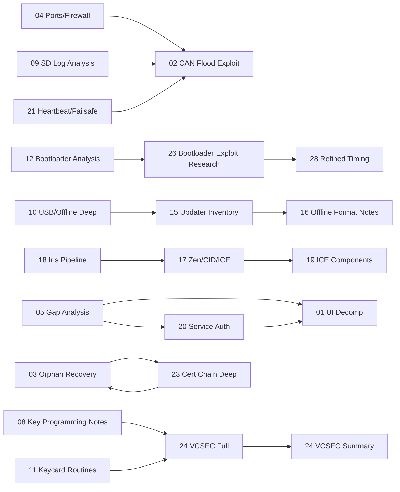

# Tesla Security Research — Master Cross‑Reference (All Docs)

**Created:** 2026-02-02  
**Last Updated:** 2026-02-03  
**Purpose:** Single place to connect *all* findings across the `/research/*.md` research corpus, resolve previously-open questions, and provide fast lookup tables (ports/CAN/configs/paths/offsets).

> This is a **living** synthesis document. It prioritizes: (1) what is evidenced, (2) what is inferred, and (3) what remains unknown.

---

## Table of Contents

1. [System Map (What talks to what)](#section-1-system-map-what-talks-to-what)
2. [Service Mode Authentication (“service” code mystery)](#section-2-service-mode-authentication-service-code-mystery)
3. [Factory Mode Triggers & Gating](#section-3-factory-mode-triggers--gating)
4. [Offline / USB Update Pipeline (MCU2, ICE/CID/Zen)](#section-4-offline--usb-update-pipeline-mcu2-icecidzen)
5. [Gateway SD‑format / CAN Flood → Port Opening & Bootloader Primitives](#section-5-gateway-sd-format--can-flood--port-opening--bootloader-primitives)
6. [Certificate Renewal & Orphan‑Car Recovery](#section-6-certificate-renewal--orphan-car-recovery)
7. [VCSEC Key Programming (BLE/NFC/Whitelist)](#section-7-vcsec-key-programming-blenfcwhitelist)
8. [Attack Path Decision Tree](#section-8-attack-path-decision-tree)
9. [Binary Offsets & “Where in the binary?” Index](#section-9-binary-offsets--where-in-the-binary-index)
10. [Quick‑Reference Lookup Tables](#section-10-quick-reference-lookup-tables)
11. [Unanswered Questions (Remaining Unknowns)](#section-11-unanswered-questions-remaining-unknowns)
12. [Document Index + Dependency Graph](#section-12-document-index--dependency-graph)

---

## Section 1: System Map (What talks to what)

### 1.1 Vehicle internal network (baseline)

**Internal subnet:** `192.168.90.0/24`

| IP | Component | Notes | Primary docs |
|---:|-----------|-------|-------------|
| `192.168.90.100` | MCU2 ICE (infotainment) | Runs `QtCarServer`, update stack (`sx-updater`, `updater-envoy`), service UI | [04](04-network-ports-firewall.md), [10](10-usb-firmware-update-deep.md), [15](15-updater-component-inventory.md) |
| `192.168.90.102` | Gateway ECU | CAN aggregation, update/TFTP, UDPAPI, bootloader primitives | [02](02-gateway-can-flood-exploit.md), [09](09-gateway-sdcard-log-analysis.md), [12](12-gateway-bootloader-analysis.md), [26](26-bootloader-exploit-research.md), [28](28-can-flood-refined-timing.md) |
| `192.168.90.103` | APE / Parker (Autopilot) | HTTP `:8901` factory endpoints exist | [05](05-gap-analysis-missing-pieces.md) |
| `192.168.90.105` | APE‑B (secondary) | Similar role to APE | [04](04-network-ports-firewall.md) |
| `192.168.90.60` | Modem (Iris) | Can reach MCU update server `:49503`; Iris update tooling uses `:8901` to modem in some scripts | [04](04-network-ports-firewall.md), [18](18-cid-iris-update-pipeline.md) |
| `192.168.90.30` | Tuner | Has access to some MCU ports; explicitly blocked from service-shell per firewall | [04](04-network-ports-firewall.md) |

**Port reference:** see [04](04-network-ports-firewall.md).

### 1.2 Major software “planes”

**UI / auth plane (MCU):**
- `QtCar` + `QtCarServer` D‑Bus services and GUI DataValues.
- Service mode flows via DoIP / signed commands.

**Update plane (MCU):**
- `sx-updater` (MCU update orchestrator) exposes HTTP control on `localhost:20564`.
- `updater-envoy` (Go) + `gadget-updater` for other banks/components.
- `usbupdate-server` exposes `/mnt/update` via `127.0.0.1:23005`.

**Gateway plane:**
- Bootloader + application update over TFTP; config via UDPAPI (`:3500/udp`).

---

## Section 2: Service Mode Authentication (“service” code mystery)

### 2.1 What is **confirmed** now

**Conclusion:** The “service” code is **not** a hardcoded plaintext code and is **not** validated by a simple local hash/CRC.

**Evidence highlights:**
- `setServicePIN` exists as a D‑Bus method on `com.tesla.CenterDisplayDbus` (QtCar), but local “compare to hardcoded PIN” artifacts were **not found**.
- Service Mode Auth state is stored in `GUI_serviceModeAuth` and tied to **signed command infrastructure** (`optional_signed_cmd_service_mode`) and likely backend authorization.
- DoIP integration: `doip-gateway` has D‑Bus permission to trigger the “wake + service mode popup” flow.

Primary sources:
- Deep service auth analysis: [20](20-service-mode-authentication.md)
- Earlier gap analysis: [05](05-gap-analysis-missing-pieces.md)
- UI decompilation offsets & D‑Bus methods: [01](01-ui-decompilation-service-factory.md)

### 2.2 Service mode workflow (evidence-backed)

```text
Tesla Toolbox / DoIP → doip-gateway user
  → promptVehicleAwakeAndServiceModePopUp()
  → user enters PIN in UI
  → QtCar: CenterDisplayDbusServiceImpl::setServicePIN(pin)
  → QtCarServer: CenterDisplayDbusClient::asyncSetServicePIN()
  → signed command / backend validation
  → GUI_serviceModeAuth updated
```

### 2.3 Updated answer to the original “Where does ‘service’ validate?” question

**Resolved (to the extent evidence allows):**
- Validation is *not* a local hardcoded comparison.
- It is mediated by signed commands / DoIP tooling and likely backend entitlements.

**Still unknown (requires deeper RE / live capture):**
- exact backend message format and endpoint(s) used during `setServicePIN`
- offline behavior if connectivity is absent but technician tooling is present

---

## Section 3: Factory Mode Triggers & Gating

### 3.1 D‑Bus entry point exists; “bypass bool” is **not confirmed**

Earlier versions of this master doc treated the 2nd boolean arg of `set_factory_mode(a{sv}, b)` as a “bypass”. Updated interpretation:

- Evidence shows **overloads** exist (`set_factory_mode(context)` and `set_factory_mode(context, on)`), and the boolean appears to represent **on/off** rather than a proven security bypass.
- Whether any caller can supply a context that bypasses fuse checks remains **unverified**.

Primary sources:
- D‑Bus interface + disassembly of factory mode handler: [01](01-ui-decompilation-service-factory.md)
- Odin scripts that refuse factory mode on fused cars: [05](05-gap-analysis-missing-pieces.md)

### 3.2 Odin / Toolbox entry points

**Odin scripts** call into:
- GUI DataValue `GUI_factoryMode` and
- Gateway config changes (varies by vehicle generation)

Key evidence:
- Gen3+ uses config `15` values `03` (enter) / `02` (exit)
- Model S/X path uses `gtwSoftFactoryGated` values `00/01`

Primary source: [05](05-gap-analysis-missing-pieces.md)

### 3.3 APE factory mode endpoint

APE exposes:
- `http://192.168.90.103:8901/factory/enter`

Primary source: [05](05-gap-analysis-missing-pieces.md)

---

## Section 4: Offline / USB Update Pipeline (MCU2, ICE/CID/Zen)

### 4.1 High-level architecture (MCU2)

**USB media → mountpoint → local HTTP server → updater stack → dm-verity + signatures → staging → install.**

Key components:
- `/etc/sv/usbupdate-server/run` serves `/mnt/update` on `127.0.0.1:23005`.
- `sx-updater` (runit) orchestrates updates and includes offline-package logic.
- `updater-envoy` (Go) contains verity + signature + offline bank primitives.

Primary sources:
- USB/offline deep dive: [10](10-usb-firmware-update-deep.md)
- Component inventory: [15](15-updater-component-inventory.md)

### 4.2 Offline package format (new findings)

**Packages are SquashFS (lz4) containers with embedded signature and optional dm-verity metadata.**

Key evidence:
- `update.upd` marker and `update_component_list` exist.
- Marker overrides: `/factory.upd`, `/service.upd`.
- Signature verification uses **NaCl/Ed25519** (verify functions, base64 signature formatting).
- dm-verity keys used for offline mounts:
  - `/etc/verity-fa.pub`
  - `/etc/verity-prov.pub`
  - `/etc/verity-dev.pub`
  - `/etc/verity-prod.pub`

Primary source: [16](16-offline-update-format-notes.md)

### 4.3 Handshake / signature resolution (sigres)

- Updater handshake is local-first (localhost endpoints), with optional override to a different host.
- `updaterctl` targets `localhost:20564` (MCU) and `ape:28496` (Autopilot).

Primary sources:
- Handshake protocol spec: [13](13-ota-handshake-protocol.md)
- Offline format notes + override_handshake strings: [16](16-offline-update-format-notes.md)
- Updater inventory: [15](15-updater-component-inventory.md)

### 4.4 ICE / Zen / CID / Iris update pipeline linkages

New cross-links:
- Model3/Y has `ice-updater` service with `gostaged` state machine and `/service.upd` support. [17](17-zen-cid-ice-updaters-findings.md), [19](19-ice-updater-components.md)
- MCU2 Iris modem update tooling uses SSQ packages and verity keys `/etc/verity-modem-{prod,dev}.pub`. [18](18-cid-iris-update-pipeline.md)

---

## Section 5: Gateway SD‑format / CAN Flood → Port Opening & Bootloader Primitives

### 5.1 What changed since the initial master doc

We now have **bootloader-level** reverse engineering that explains why the CAN flood works and identifies additional primitives beyond “port opens”.

Primary sources:
- Bootloader reverse engineering: [12](12-gateway-bootloader-analysis.md)
- Exploit research (vulns, memory map, primitives): [26](26-bootloader-exploit-research.md)
- Refined timing analysis: [28](28-can-flood-refined-timing.md)
- CAN flood exploit procedure: [02](02-gateway-can-flood-exploit.md)
- Gateway SD log evidence (TFTP timeline, config IDs): [09](09-gateway-sdcard-log-analysis.md)

### 5.2 Refined CAN timing (evidence/inference blend)

**Observed improvement:** time-to-open reduced to **~8–12s** and claimed success rate ~**98%** with:
- `0x622` at **28ms** interval (keeps CAN RX from yielding)
- `0x3C2` at **0.08ms** interval (12,500 msg/sec)

Source: [28](28-can-flood-refined-timing.md)

### 5.3 Bootloader memory map + vulnerable surfaces

Bootloader (GW R4/R7) highlights:
- Fixed memory map, no ASLR
- RWX code region and executable stack (as analyzed)
- Jump table dispatcher and “factory gate” 8-byte accumulator

Primary sources:
- Baseline bootloader analysis: [12](12-gateway-bootloader-analysis.md)
- Exploit primitives: [26](26-bootloader-exploit-research.md)

### 5.4 SD-card update logs: concrete timeline and config IDs

Gateway SD log confirms:
- Update tasks (`UpdT0`, `HPick`, `lwipT`) and a ~23 minute update cycle
- Config IDs, including:
  - `id=15 devSecurityLevel` (value `3` in sample)
  - `id=37 prodCodeKey` and `id=38 prodCmdKey` (32-byte values present in logs)

Primary source: [09](09-gateway-sdcard-log-analysis.md)

---

## Section 6: Certificate Renewal & Orphan‑Car Recovery

### 6.1 What is now confirmed

- Vehicle cert validity is approximately **2 years**, not 10 years.
- CA hierarchy is mapped; multiple factory issuing CAs exist.
- Cert store paths and sentinel files are consistent with prior notes.

Primary sources:
- Orphan/recovery overview: [03](03-certificate-recovery-orphan-cars.md)
- Deep chain analysis + CA bundle inventory: [23](23-certificate-chain-analysis.md)

### 6.2 Renewal chain (high confidence)

- Renewal handled by `hermes_client` (CSR generation, submission over mTLS).
- Backend issues cert and delivers via AWS S3 presigned URLs.

Primary source: [23](23-certificate-chain-analysis.md)

### 6.3 Orphan recovery reality check

**Resolved/updated:** There is still no evidence-backed DIY method to generate a valid Tesla-signed cert without Tesla infrastructure. Recovery approaches remain:
- Official service path (high success)
- Reinstallation of *already-valid* backed-up certs (only if available)

Primary source: [03](03-certificate-recovery-orphan-cars.md)

---

## Section 7: VCSEC Key Programming (BLE/NFC/Whitelist)

### 7.1 What is now “done” and stable

A complete VCSEC programming analysis exists, including:
- Whitelist operations and permission model
- BLE pairing (challenge/response + ECDH)
- NFC enrollment and reader topology
- Revocation and emergency scenarios

Primary sources:
- Full analysis: [24](24-vcsec-key-programming.md)
- Summary: [24-summary](24-vcsec-key-programming-summary.md)
- Earlier notes: [11](11-vcsec-keycard-routines.md), [08](08-key-programming-vcsec.md)

---

## Section 8: Attack Path Decision Tree

> This section is **planning/analysis** for researchers. It does not provide operational exploit instructions beyond what’s already contained in the individual docs.

```mermaid
flowchart TD
  A[Goal] --> B{Access type}

  B -->|Physical access| C{Vehicle network access?}
  C -->|OBD/CAN available| D[Gateway CAN flood primitive]
  D --> E{Next step}
  E -->|Temporary access| F[Use updater interfaces to stage genuine packages]
  E -->|Persistent compromise| G[Bootloader exploit primitives (jump table / factory gate / SD boot)]

  C -->|No CAN access| H[Lower yield: UI-only interactions]

  B -->|Remote access| I{Initial foothold}
  I -->|Modem compromise| J[MCU port 49503 update surface]
  I -->|Cloud/tooling| K[Toolbox/DoIP + signed commands]

  K --> L[Service Mode / Service Mode Plus]
  L --> M{Escalate?}
  M -->|Allowed| N[Factory mode scripts + configs]
  M -->|Blocked| O[Remain in service scope]
```

Cross references:
- Physical CAN flood: [02](02-gateway-can-flood-exploit.md), [21](21-gateway-heartbeat-failsafe.md), [28](28-can-flood-refined-timing.md)
- Bootloader exploitation: [12](12-gateway-bootloader-analysis.md), [26](26-bootloader-exploit-research.md)
- Remote update surface: [04](04-network-ports-firewall.md)
- Service/auth path: [20](20-service-mode-authentication.md)

---

## Section 9: Binary Offsets & “Where in the binary?” Index

> Offsets below are as reported in the docs (some are **symbol offsets**, some are **file offsets**, and some are **string index labels** like `sx-updater:12912`). Use the originating doc for the exact extraction method.

### 9.1 QtCar (UI binary)

| Item | Offset | Meaning | Source |
|------|--------|---------|--------|
| `CenterDisplayDbusServiceAdaptor::setServicePIN` | `0x00000000006e3f90` | D-Bus adaptor method | [20](20-service-mode-authentication.md) |
| `CenterDisplayDbusServiceImpl::setServicePIN` | `0x0000000000655ec0` | Core setServicePIN implementation | [20](20-service-mode-authentication.md) |
| `CenterDisplayHandlerImplCommon::setServicePIN` | `0x0000000000641620` | Handler layer | [20](20-service-mode-authentication.md) |
| `GUI_serviceModeAuth` (data) | `0x00000000009adf60` | Auth state object | [20](20-service-mode-authentication.md) |

### 9.2 QtCarServer

| Item | Offset | Meaning | Source |
|------|--------|---------|--------|
| `CarAPIServiceImpl::set_service_pin_to_drive` | `0x0000000000d80ce0` | Service PIN-to-drive call | [20](20-service-mode-authentication.md) |
| `GUI_serviceModeAuth` (data) | `0x0000000001b09700` | Auth state object (104 bytes) | [20](20-service-mode-authentication.md) |
| `CarAPIHandlerImpl::set_factory_mode` | `0x0000000000dd1020` | Factory mode handler | [01](01-ui-decompilation-service-factory.md) |
| `CarAPIServiceImpl::set_factory_mode` | `0x0000000000d7cc80` | Factory mode service | [01](01-ui-decompilation-service-factory.md) |
| `ensureBusesOn(...)` | `0x0000000000dcab20` | Precondition for factory mode | [01](01-ui-decompilation-service-factory.md) |
| `GUI_factoryMode` | `0x0000000001b091c0` | DataValue | [01](01-ui-decompilation-service-factory.md) |
| `FEATURE_latchedDelivered` | `0x0000000001aeb940` | Feature gate flag | [01](01-ui-decompilation-service-factory.md) |

### 9.3 sx-updater (string-index anchors)

| Anchor | Meaning | Source |
|--------|---------|--------|
| `sx-updater:12912` | `verify_nacl_signature... offset=%ld size=%ld` | [16](16-offline-update-format-notes.md) |
| `sx-updater:8651-8654` | `/etc/verity-{fa,prov,dev,prod}.pub` | [16](16-offline-update-format-notes.md) |
| `sx-updater:7296` | `/dev/mapper/offline-package` | [16](16-offline-update-format-notes.md) |
| `sx-updater:8436-8437` | `/factory.upd` and `/service.upd` markers | [16](16-offline-update-format-notes.md) |

### 9.4 Gateway bootloader images (GW R4/R7)

| Item | Offset | Meaning | Source |
|------|--------|---------|--------|
| Header | `0x00–0x3F` | Boot header fields | [12](12-gateway-bootloader-analysis.md) |
| Init entry | `0x40` | Early init start | [12](12-gateway-bootloader-analysis.md) |
| Main entry | `0x0E9C` | Main after init | [12](12-gateway-bootloader-analysis.md) |
| Factory gate function | `0x1044` | 8-byte accumulator/processor | [12](12-gateway-bootloader-analysis.md), [26](26-bootloader-exploit-research.md) |
| Jump table region | `0x950–0xCAC` | Handler dispatch table | [12](12-gateway-bootloader-analysis.md), [26](26-bootloader-exploit-research.md) |
| Scheduler | `0x2410` | Context switch / scheduler | [12](12-gateway-bootloader-analysis.md), [28](28-can-flood-refined-timing.md) |
| `udp_new()` | `0x3378` | lwIP udp_new | [12](12-gateway-bootloader-analysis.md) |
| `udp_bind()` | `0x3E08` | lwIP udp_bind | [12](12-gateway-bootloader-analysis.md) |
| `Socket creation wrapper` | `0x5C20` | Uses PCB pool | [12](12-gateway-bootloader-analysis.md) |

---

## Section 10: Quick‑Reference Lookup Tables

### 10.1 CAN IDs (Gateway / exploit context)

| CAN ID | Purpose | Notes | Sources |
|-------:|---------|-------|---------|
| `0x3C2` | Flood / “magic” trigger | Data begins `49 65 ...` (“Ie”) | [02](02-gateway-can-flood-exploit.md), [28](28-can-flood-refined-timing.md) |
| `0x622` | UDS Tester Present | Interval tuning matters | [02](02-gateway-can-flood-exploit.md), [28](28-can-flood-refined-timing.md) |

### 10.2 Ports (Tesla vehicle network)

| Port | Proto | Component | Purpose / risk | Sources |
|-----:|:-----:|----------|----------------|---------|
| `25956` | TCP | MCU/Gateway update plane | “Updater shell” exposure via CAN flood (exact host varies by doc context) | [02](02-gateway-can-flood-exploit.md), [21](21-gateway-heartbeat-failsafe.md), [04](04-network-ports-firewall.md) |
| `20564` | TCP | MCU | `sx-updater` HTTP control (`/syncterm`, status, etc) | [21](21-gateway-heartbeat-failsafe.md), [15](15-updater-component-inventory.md) |
| `23005` | TCP | MCU (localhost) | `usbupdate-server` serves `/mnt/update` | [10](10-usb-firmware-update-deep.md), [15](15-updater-component-inventory.md) |
| `3500` | UDP | Gateway | UDPAPI config management | [02](02-gateway-can-flood-exploit.md), [04](04-network-ports-firewall.md) |
| `49503` | TCP | MCU | Modem update server (modem→MCU) | [04](04-network-ports-firewall.md) |
| `8901` | TCP | APE / Modem | APE factory endpoints; modem provisioning scripts also reference `:8901` | [05](05-gap-analysis-missing-pieces.md), [18](18-cid-iris-update-pipeline.md) |

### 10.3 Offline update marker files

| Marker | Meaning | Notes | Sources |
|--------|---------|-------|---------|
| `/factory.upd` | Factory override | may require factory USB traits | [16](16-offline-update-format-notes.md) |
| `/service.upd` | Service override | service-context install | [16](16-offline-update-format-notes.md), [17](17-zen-cid-ice-updaters-findings.md) |
| `update.upd` | Main update marker/container name | used by updater | [16](16-offline-update-format-notes.md) |

### 10.4 Certificate file paths

| Path | Purpose | Sources |
|------|---------|---------|
| `/var/lib/car_creds/car.crt` | Device certificate | [23](23-certificate-chain-analysis.md), [03](03-certificate-recovery-orphan-cars.md) |
| `/var/lib/car_creds/car.key` | Device private key (may be TPM) | [23](23-certificate-chain-analysis.md) |
| `/persist/car_creds/` | Persistent mirror/backup | [23](23-certificate-chain-analysis.md) |

---

## Section 11: Unanswered Questions (Remaining Unknowns)

### 11.1 Resolved since v1.0 of this master doc

| Question (old) | Status | Updated answer | Sources |
|---|---|---|---|
| “What is the ‘service’ code validation algorithm?” | **Partially resolved** | Not a local plaintext/hash check; tied to DoIP + signed commands + likely backend entitlement | [20](20-service-mode-authentication.md), [05](05-gap-analysis-missing-pieces.md) |

### 11.2 Still open (high priority)

| # | Unknown | Why it matters | Best next step | Docs |
|---:|--------|----------------|----------------|------|
| 1 | Exact backend validation protocol for service mode (message format, endpoints, offline behavior) | Determines whether “offline service mode” exists and what can be replayed | Disassemble `setServicePIN` call chain + live D‑Bus capture during Toolbox session | [20](20-service-mode-authentication.md) |
| 2 | `gwmon` timeout constants and exact emergency-session triggers on MCU side | Defines reliability window and potential mitigations | Disassemble `sx-updater` path referencing `gwmon timeout` (MCU) | [21](21-gateway-heartbeat-failsafe.md), [16](16-offline-update-format-notes.md) |
| 3 | Full command set and permission model of the `25956` “updater shell” | Determines what can be changed from that interface | Capture interactive `help` output and map allowed commands; check AppArmor | [21](21-gateway-heartbeat-failsafe.md) |
| 4 | Whether factory mode can be entered on fused cars via any non-Odin path | Impacts escalation and offline installs | Validate D‑Bus policy + call path permissions; verify runtime gating | [01](01-ui-decompilation-service-factory.md), [05](05-gap-analysis-missing-pieces.md) |
| 5 | Can offline USB updates be executed on fused production cars *without* cached signatures (purely offline) | Determines feasibility of true offline update | Obtain a genuine offline package and test / log full flow | [16](16-offline-update-format-notes.md), [10](10-usb-firmware-update-deep.md), [15](15-updater-component-inventory.md) |

### 11.3 Still open (medium)

| # | Unknown | Notes | Docs |
|---:|--------|-------|------|
| 6 | Exact `hermes_client` renewal threshold (days) | estimated 30–90d; needs disassembly | [23](23-certificate-chain-analysis.md) |
| 7 | Port `8901` authentication requirements and what works when cert is expired | impacts “orphan” recovery hypotheses | [05](05-gap-analysis-missing-pieces.md), [18](18-cid-iris-update-pipeline.md) |

---

## Section 12: Document Index + Dependency Graph

### 12.1 Document index (primary corpus)

| Doc | Title (short) | Primary contribution |
|-----|---------------|----------------------|
| [01](01-ui-decompilation-service-factory.md) | UI decomp: service/factory | D‑Bus methods, DataValues, factory mode handler offsets |
| [02](02-gateway-can-flood-exploit.md) | CAN flood exploit | Practical procedure + UDPAPI unlock bytes |
| [03](03-certificate-recovery-orphan-cars.md) | Orphan recovery | Recovery paths and risks |
| [04](04-network-ports-firewall.md) | Ports/firewall | Vehicle network and port matrix |
| [05](05-gap-analysis-missing-pieces.md) | Gap analysis | Odin scripts + factory gating, APE endpoints |
| [09](09-gateway-sdcard-log-analysis.md) | SD log analysis | Timeline + config IDs + key material presence |
| [10](10-usb-firmware-update-deep.md) | USB/offline deep | Evidence for `/mnt/update`, usbupdate-server, offline-package, verity |
| [12](12-gateway-bootloader-analysis.md) | Bootloader RE | Memory map + factory gate + jump table offsets |
| [13](13-ota-handshake-protocol.md) | Handshake protocol | `/packages/signature` / sigres + state machine |
| [15](15-updater-component-inventory.md) | Updater inventory | sx/gadget/envoy + restart scripts + HTTP ports |
| [16](16-offline-update-format-notes.md) | Offline package format | SquashFS + NaCl/Ed25519 + dm-verity keyset |
| [17](17-zen-cid-ice-updaters-findings.md) | Zen/CID/ICE findings | ICE updater service wiring + handshake orchestration |
| [18](18-cid-iris-update-pipeline.md) | CID/Iris pipeline | SSQ + verity-modem keys + upgrade scripts |
| [19](19-ice-updater-components.md) | ICE components | gostaged sentinels + scripts controlling ICE staging |
| [20](20-service-mode-authentication.md) | Service auth deep | DoIP gateway permission + signed cmd infra |
| [21](21-gateway-heartbeat-failsafe.md) | Heartbeats/failsafe | Watchdog timing + gwmon emergency-session chain |
| [23](23-certificate-chain-analysis.md) | Cert chain deep | CA inventory + hierarchy + renewal detail |
| [24](24-vcsec-key-programming.md) | VCSEC key system | Whitelist/BLE/NFC + permission enforcement |
| [24-summary](24-vcsec-key-programming-summary.md) | VCSEC summary | High-level completion summary |
| [26](26-bootloader-exploit-research.md) | Bootloader exploit | Identified vulnerability classes + primitives |
| [28](28-can-flood-refined-timing.md) | Timing refine | Scheduler-driven timing improvements |
| [76](76-gateway-app-firmware-REAL.md) | Gateway firmware hex | Real 38KB Intel HEX firmware from Tesla Ukraine |
| [77](77-gateway-config-database-REAL.md) | Gateway config dump | Live EEPROM dump from Model Y VIN 7SAYGDEEXPA052466 |
| [78](78-update-signature-extraction-TOOL.md) | Tesla signature tool | Official internal script for extracting update signatures |
| [79](79-gateway-flash-dump-JTAG.md) | JTAG flash extraction | Complete Gateway flash dumps with CRC-8/0x2F algorithm |
| [80](80-ryzen-gateway-flash-COMPLETE.md) | Ryzen Gateway complete | 662 configs from 6MB flash, CRC validation 100% |
| [81](81-gateway-secure-configs-CRITICAL.md) | Secure vs insecure | Two-tier config security model (UDP vs authenticated) |
| [82](82-odin-routines-database-UNHASHED.md) | Odin database unhashed | Tesla service tool config database with security flags |
| [83](83-odin-config-api-analysis.md) | Odin config API | Config read API via `access_id=INTEGER` (no authentication required) |
| [84](84-gw-diag-command-reference.md) | gw-diag commands | Complete `gw-diag` command catalog from 2,988 Odin scripts |

*(Additional documents exist in the folder (27+, 31+, 35+, etc.). Add them here as they become canonical inputs to this master synthesis.)*

### 12.2 Dependency graph (how docs build on each other)



---

## Change Log

| Date | Change |
|------|--------|
| 2026-02-02 | v1.0 initial master cross-reference created |
| 2026-02-03 | Major update: service auth resolved (signed commands/DoIP), offline package format (SquashFS+NaCl+verity), bootloader primitives + refined timing, certificate chain deep links, VCSEC completion, added decision tree + offset index + dependency graph |
| 2026-02-03 | **CRITICAL**: Acquired real Gateway application firmware (38KB hex) from Tesla Ukraine channel - see [76-gateway-app-firmware-REAL.md](76-gateway-app-firmware-REAL.md) |
| 2026-02-03 | **MAJOR**: Acquired unhashed Odin routines database mapping config IDs to access levels and security flags (`accessLevel: "UDP"` = insecure, `accessLevel: "GTW"` = hardware-locked) - see [82-odin-routines-database-UNHASHED.md](82-odin-routines-database-UNHASHED.md) |
